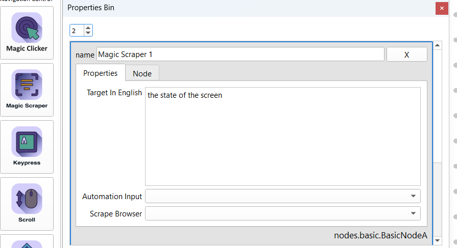

This documentation details Open Agent Studio's no-code actions, designed to build powerful desktop automations without writing code. Each action is described along with its input parameters and an example use case.

### 1. Start Node

**Icon:** 

**Description:**  Initiates the automation process by opening a specified application or a URL.

**Input Parameters:**

- **Initial Program:** The path to the program's executable (e.g., "C:\Program Files\Google\Chrome\Application\chrome.exe").
- **Arguments:**  Additional commands for the program, often a URL for a web browser.
- **Data:** Stores the node's settings in JSON format.

**Example Use Case:**  To begin your automation by opening the Cheat Layer website, put your browser's path in "Initial Program" and "https://cheatlayer.com" in "Arguments".

### 2. Move Mouse

**Icon:** 
**Description:**  Moves the mouse cursor to precise coordinates on your screen.

**Input Parameters:**

- **X Coordinate:** Horizontal position (pixels).
- **Y Coordinate:**  Vertical position (pixels).

**Example Use Case:**  Place the cursor over a specific area within an application before clicking or typing.

### 3. Magic Clicker

**Icon:** 

**Description:**  Simulates various mouse click types, either by coordinates or using semantic targeting of elements.

**Input Parameters:**

- **Automation Input:**  Allows for dynamic clicks based on global variables or inputs from "phone_transcript", "email_transcript", or "sms_transcript".
- **X:** Horizontal coordinate (pixels).
- **Y:** Vertical coordinate (pixels).
- **Click Type:**  
    - "Single Left Click": Standard click.
    - "Single Right Click": For opening right-click menus. 
    - "Double Click": For opening files or selecting text.
    - "Drag":  Click and hold for moving elements. 
- **Mode:** 
    - **Desktop:** Clicks are based on "X" and "Y" coordinates.
    - **Browser:**  Targets elements within the web browser using a semantic description ("Target In English").
    - **First/Last:** If there are multiple matches, clicks the first or last matching element.
    - **Loop Total Runs/Loop Node Runs:**   Repeats the click a set number of times or based on the number of times this node has run.
- **Target In English:** Describe the web element to be clicked (e.g., "Download button," "Menu link").
- **Data:** Node settings in JSON.

**Example Use Cases:**

- Click a button on a form:  Set "Mode" to "Browser", describe the button in "Target In English".
- Click a specific area in an application: Use "Desktop" mode and "X", "Y" coordinates. 

### 4. Keypress

**Icon:** 

**Description:** Automates keyboard input, sending keystrokes and typing text to the active window.

**Input Parameters:**

- **String:**  The key or character sequence to type (e.g., "enter", "Hello, World!").
- **Saved Values:**  Provides a quick option to type the current directory path. 
- **GPT-4 Mode:** Let GPT-4 process the "String" before the keypress, enabling dynamic content generation.
- **Automation Input:** Use a global variable to define the keystroke sequence. 
- **Data:** Node settings in JSON.

**Example Use Cases:**

-  Press Enter to submit a form:  Set "String" to "enter".
- Type a message into a document: Provide the text in the "String" parameter.

### 5. Delay

**Icon:** 

**Description:**  Introduces a pause in the automation to allow time for websites to load, processes to complete, etc.

**Input Parameters:**

- **seconds:** The duration of the pause expressed in seconds.

**Example Use Case:** Wait for a web page to load after clicking a link before trying to interact with it.

### 6. Open Program

**Icon:** 

**Description:** Opens a specified program on your computer with optional arguments.

**Input Parameters:**

- **program:** The path to the application's executable file (e.g., "C:\Program Files\Notepad++\notepad++.exe").
- **arguments:** (Optional) Parameters to pass to the program.  For a web browser, this would be the URL.
- **Automated Input:** You can dynamically define the program and arguments using a global variable.
- **Data:** Node settings in JSON. 

**Example Use Case:** Open a website in Chrome by setting "program" to your Chrome executable path and "Arguments" to "https://www.example.com".

### 7. Bash

**Icon:** 

**Description:**  Executes a bash command in your operating system's terminal.

**Input Parameters:**

- **command:** The bash command you want to be executed,  including any necessary arguments.

**Example Use Case:**  Run a command to update a system package:  `sudo apt-get update`

### 8. Python Code

**Icon:** 

**Description:**  Embed custom Python code directly into your workflow to add complex logic or interact with external libraries. 

**Input Parameters:**

- **code:** The Python code block to execute.

**Special Features:**

- **Dynamic Variable Substitution:** Placeholders like `{{my_variable}}` will be replaced by the corresponding values from your global variables.
- **Access to Internal Functions:**  Your code can access Open Agent Studio's internal functions to send notifications, manage variables, and more.

**Example Use Cases:** 

- **Data Processing:** Clean and manipulate data scraped from a website (e.g., extract specific values, format text). 
- **API Integration:**  Interact with external web services by making API calls and handling the results.

### 9. Magic Scraper (Semantic Scrape)

**Icon:** 

**Description:**  Describes a targeted region of a screenshot using AI. This provides a way  to dynamically identify web elements, even if their visual presentation changes.

**Input Parameters:**

- **Target In English:** Describe in plain English what you want to target (e.g., "The blue button that says 'Next'",  "The product image in the corner").
- **Automation Input:** If needed, you can provide the description dynamically using a global variable. 
- **Scrape Browser:** When used with web automations,  lets you specify the type of web elements to analyze (e.g., "Buttons").
- **Data:** Node settings in JSON.

**Example Use Case:**  Accurately target a button that has a varying position or changes its appearance from time to time.

-  **Extract pricing data from an e-commerce website:**  Use a description like "prices of all the laptops."
-  **Collect article titles from a news website:**  Use "article" as the "Target" and a description like "headlines of all articles."

### 11. Print

**Icon:**  

**Description:** Displays the value of a specific global variable in Open Agent Studio's console for debugging.

**Input Parameters:**

- ** Variables:** Select the global variable whose contents you want to see in the console output.

**Example Use Case:**   Ensure that data scraped from a website has been stored correctly in a global variable before using it in another action. 

### 12. Scroll

**Icon:** 

**Description:**  Automates the scrolling of a window - primarily useful for web pages. 

**Input Parameters:**

- **Distance:**  Specifies the amount of scrolling, with positive values scrolling down and negative values scrolling up.

**Example Use Case:**  Scroll to the bottom of a long web page to reveal more content to be scraped.

### 13. Send Data

**Icon:** 

**Description:** Sends data to an external application or webhook using HTTP requests. Enables integration with web services.

**Input Parameters:**

- **Body Key 1/ Body Value 1 ... **:  These key-value pairs represent the data you want to send, with keys acting as labels.
- **Request:** Typically "POST" for sending data.
- **URL:** The web address to send the data to (e.g., a webhook URL, API endpoint).

**Example Use Cases: **

- **Add data to a Google Sheet:** Send the data to a special URL provided by Google Sheets.
- **Trigger an action in another application:** Send data to a webhook configured to receive data and initiate a task. 

### 14. If Else

**Icon:** 

**Description:**  Adds conditional logic to your automations, letting the agent make choices based on data or conditions. 

**Input Parameters:**

- **Variables:**  The global variable to be evaluated. 
- **operator**: 
    - `includes`: Checks if one string contains another.
    -  `equals`: Tests for an exact match. 
    - `greater than / less than`:  For numerical comparisons.
    -  `regex match`:  Uses regular expressions for more complex pattern matching. 
- **condition:** The criteria to check against the "Variables" (e.g., a specific string, a number, a regular expression).

**Example Use Case:** You're scraping a webpage. If the text "Out of Stock" is found, you might want to trigger one set of actions, and a different set if its "In Stock'.

### 15. Generalized Agent

**Icon:** 

**Description:** Execute a pre-built automation agent — a self-contained automation flow — as a step within your larger workflow.  

**Input Parameters:**

- **prompt:** A brief description of the task you want the generalized agent to handle (e.g., "send a confirmation email", "upload a file to Dropbox," "check for new updates," "open a Google Sheet").  

**Example Use Case:**   You've downloaded a file. Use a Generalized Agent to automate the process of uploading it to your chosen cloud storage provider.

### 16. Google Sheets

**Icon:**  

**Description:**  Reads or writes data to and from Google Sheets,  ideal for storing scraped information, managing lists, or dynamic input.

**Input Parameters:**

- **URL:** The web address of your Google Sheet (including the sheet ID).
- **Read/Write:**  Choose whether you want to "Read" data from or "Write" data to the sheet.
- **sheet name:**  The name of the specific sheet tab (worksheet) within your Spreadsheet. 
- **Row 1 / Row 2 ... **:  (For writing) Define which data variables go into each row.  (For reading) Define which rows to read from.

**Example Use Cases:**

- Log scraped product data in a Google Sheet.
- Read a list of URLs from a Google Sheet as input for further automation actions. 

### 17. Email

**Icon:** 

**Description:**  Sends an email message with optional attachments.

**Input Parameters:**

- **to**:  The email address of the recipient.
- **to variable:**  Select a global variable that holds the recipient's email address (useful for dynamic emails). 
- **subject**: Subject line of the email.
- **body**:  The main content (message) of the email.
- **Body variable**:  Select a global variable containing additional email content if needed.
- **file**:  (Optional)  Path to the file that should be attached to the email.

**Example Use Case:** Alert yourself by email when a specific condition is met during automation, such as a product becoming available. 

Okay, here is the documentation for the remaining no-code actions.

### 18. Math

**Icon:** 

**Description::** Perform basic arithmetic operations within your workflow.

**Input Parameters:**

- **action:** Select the operation (add, subtract,  multiply, divide).
- **input:** A global variable containing the first number for the operation.
- **value:** Either a number or another global variable containing the second number.

**Example Use Case:**  Calculate discounts on e-commerce prices by subtracting a percentage.  

### 19. GetData

**Icon:** 

**Description:** Retrieves data from a URL, including web pages, APIs, or local files. 

**Input Parameters:**

- **URL:**  The URL or file path of the data you want to fetch.
- **Headers:** (Optional)   Headers to include in the HTTP request, formatted as JSON (useful for API authentication or specifying content types).  

**Example Use Cases:**

- **Get Data from a website:**  Fetch the HTML content of a webpage.
- **Call an API:**  Get data from an API endpoint.

### 20. Download

**Icon:** 

**Description:**  Downloads a file from a URL to your computer.

**Input Parameters:**

- **URL or File:**  The URL of the file to download or the path to a file if you want to open it.
- **Download Location:** The path on your computer where the downloaded file will be saved.
- **Headers:** (Optional)  HTTP headers, formatted as JSON.

**Example Use Case:** Automate the process of downloading a file from a remote server. 

### 21. Screenshot

**Icon:** 

**Description:** Captures a screenshot of your entire screen or a specified region.

**Input Parameters:**

- **Location:** The complete path where you want the screenshot file to be saved (e.g., "C:\screenshots\my_screenshot.png").

**Example Use Case:** Document the state of your desktop during automation or capture images for visual analysis.

### 22. Webcam

**Icon:**   

**Description:**  Captures an image from a connected webcam, saving the image to your computer.

**Input Parameters:**

-  **File Name:**  The name the captured image will be saved as (e.g.,  "webcam_capture.jpg").

 **Example Use Case:** You could integrate webcam captures into a workflow that analyzes images for visual inspection tasks or for gathering visual data. 

### 23. Stable Video  

**Icon:** 

 **Description:**  Generates videos based on text descriptions, using a variation of Stable Diffusion optimized for dynamic video content (requires Replicate API integration).

**Input Parameters:**

- **prompt:** A detailed text description of the video you want to create. The more specific, the better (e.g.,  "a robot exploring a futuristic cityscape at night").
- **motion bucket:**  Selects a category of motion to apply to your video (these motion buckets come from Replicate. You can find details on Replicate's model page). 
- **file:**  The filename to save the generated video as.
- **Automation Input:**  If your description is generated earlier in the workflow, you can use a variable here. 
- **frames:**  Determines the number of frames and the technique used for generating video frames. Options like "25_frames_with_svd_xt" are from Replicate. Please check the Replicate model page for updated options. 
- **resolution:**  
    -  `maintain_aspect_ratio`: Keeps the original dimensions. 
    -  `crop_to_16_9`:  Fits video into a 16:9 widescreen format.
    -  `use_image_dimensions` : If your input is an image, the generated video will use its dimensions.

**Example Use Cases:**

- **Create animated product demos:**  Describe your product in action. 
- **Generate short, conceptual videos:** Experiment with visual ideas or illustrate concepts for educational content. 

### 24. GPT-4 

**Icon:** 

**Description:**  Leverage the power of OpenAI's GPT-4 language model for advanced language processing and content creation.

**Input Parameters:**

- **input:** The text you want GPT-4 to work with. 
- **Automation Input:**  If the input comes from previous actions in your automation, select a global variable here.
- **Webhook Input:**  Configure how data is handled if the node is triggered by a webhook.
- **type output:** If set to true, GPT-4's output will be treated as code, ready for execution.

**Example Use Cases:**

- **Content Generation:**  Create blog posts, write stories, poems, or scripts for videos. 
- **Data Summarization:**  Condensing lengthy articles into digestible summaries. 
- **Code Writing:** GPT-4 can be used to generate code snippets or write entire programs.
- **Chatbots:**  Build AI-powered chatbots that interact naturally with users.

### 25. General (Project Atlas)

**Icon:** 

**Description:**  Describes the task you want to automate in plain English and lets the Cheat Layer AI (Project Atlas) figure out how to execute it, using its knowledge of UI patterns and web elements.

**Input Parameters:**

-  **prompt:**  Tell Project Atlas what you want it to do using clear and specific language. 

**Example Use Case:** "Create a Twitter post with a picture of a cat and the hashtag #cutecats." Project Atlas will attempt to launch Twitter (if not already open), compose the post, find an image of a cat (possibly using AI image generation), and publish the tweet.

